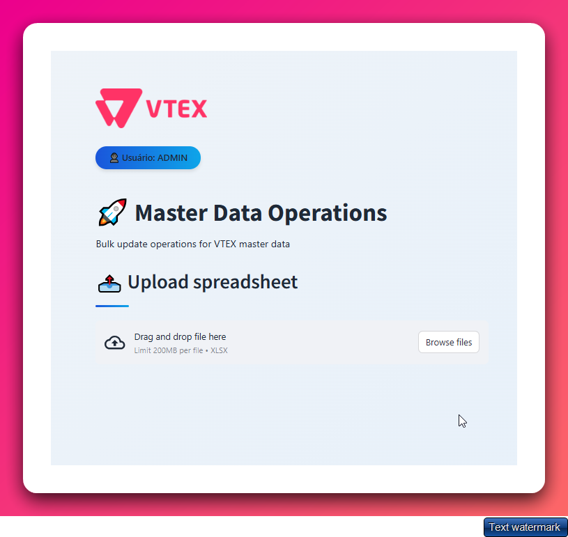
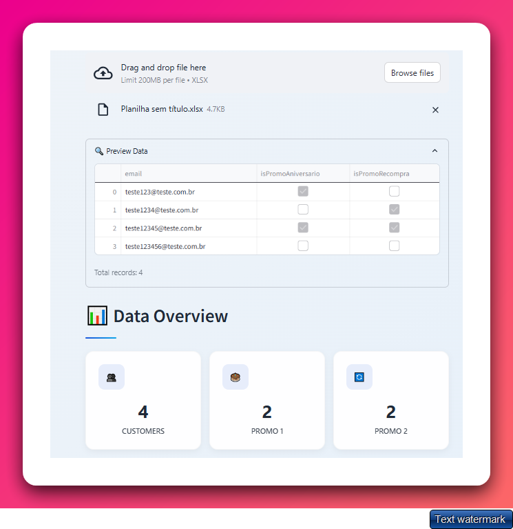
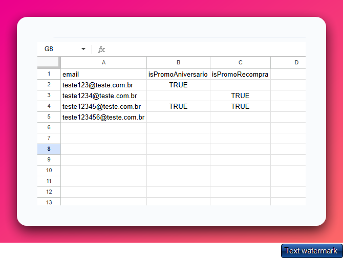
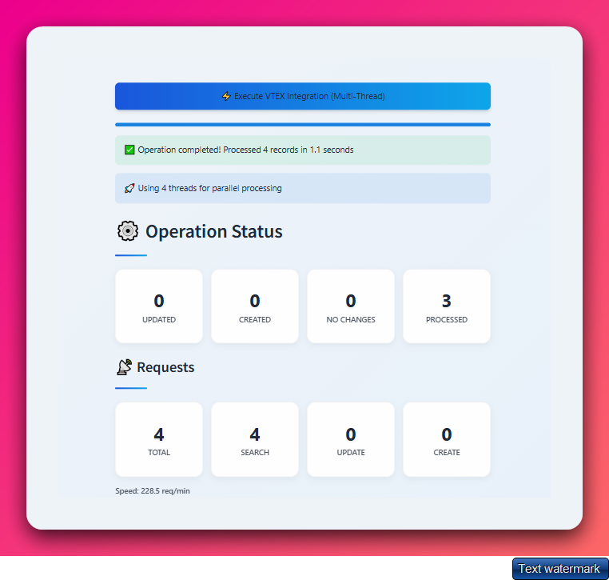

# VTEX Master Data Integration 🚀










Sistema avançado de integração para operações em massa no **VTEX Master Data**, totalmente desenvolvido por mim com foco em **performance**, **usabilidade** e **automação de grandes volumes de dados**.

> **Feito com 💻 + ☕ + muito código por Matheus Gama**

---

## 🚀 Funcionalidades Principais

- 🔐 **Controle de Acesso por Nível de Usuário** (Admin / Operador)  
- ⚡ **Processamento Multi-thread** (número de threads configurável)  
- 📊 **Monitoramento em Tempo Real** com barra de progresso  
- 📥 **Importação de Dados via Excel**  
- 📤 **Relatórios de Auditoria Detalhados**  
- 🎨 **UI Premium com Dark Mode**  

---

## 🛠️ Tecnologias Utilizadas

- **Python 3.10+**
- **Streamlit** (Framework de Interface)
- **VTEX Master Data API**
- **Pandas** (Processamento de Dados)
- **Concurrent.Futures** (Execução Paralela)

---

## ⚙️ Instalação

### 1. Clone o repositório:

```bash
git clone https://github.com/yourusername/vtex-master-data-integration.git
cd vtex-master-data-integration
```

### 2. Instale as dependências:

```bash
pip install -r requirements.txt
```

### 3. Configure o ambiente:

```bash
cp .env
```

> **Depois edite o `.env` com suas credenciais VTEX e parâmetros de configuração**

---

## 📄 Configuração (.env)

| Variável            | Descrição                          |
|---------------------|------------------------------------|
| `VTEX_APP_KEY`      | Sua chave de API VTEX              |
| `VTEX_APP_TOKEN`    | Seu token de API VTEX              |
| `VTEX_ACCOUNT_NAME` | Nome da sua conta VTEX             |
| `ADMIN_PASSWORD`    | Senha do usuário administrador     |
| `OPERATOR_PASSWORD` | Senha do usuário operador          |
| `THREAD_COUNT`      | Número de threads paralelas (padrão: 4) |

---

## ▶️ Como Rodar a Aplicação

```bash
streamlit run src/app.py
```

Depois, acesse no navegador:  
[http://localhost:8501](http://localhost:8501)

---

## 📝 Como Usar

1. **Login:**  
Use as credenciais definidas no `.env` (Exemplo: admin / admin123)

2. **Upload do Arquivo Excel:**  
Faça upload de uma planilha com os dados dos clientes.

3. **Execução:**  
Inicie a integração com a VTEX.

4. **Monitoramento:**  
Acompanhe o progresso em tempo real diretamente na interface.

5. **Relatório:**  
Baixe um relatório completo da operação (sucessos e falhas).

---

## 📊 Formato do Arquivo Excel

| Coluna               | Tipo      | Descrição                         |
|----------------------|-----------|-----------------------------------|
| `email`              | string    | E-mail do cliente (chave primária)|
| `isPromoAniversario` | boolean   | Flag de promoção 1                |
| `isPromoRecompra`    | boolean   | Flag de promoção 2                |

---

## 🚦 Performance

- Processa aproximadamente **500 registros por minuto por thread**
- Suporta até **1.000.000 registros por operação**
- **Auto scaling** com base na configuração de threads

---

## 👨‍💻 Autor

Desenvolvido por **Matheus Renzo Gama**

> Curtiu o projeto? Me chama pra trocar ideia, bater papo sobre automação, desenvolvimento ou integração com a VTEX!

📬 **Contato:**  
[https://www.linkedin.com/in/matheusrenzogama](https://www.linkedin.com/in/matheus-renzo-gama-a396b5367/)  
Ou me ache no Instagram: [@renzo_ia](https://www.instagram.com/matheusrenzo.exe/)

---

## 💡 Contribuição / Feedback

Se quiser sugerir melhorias, reportar bugs ou só trocar uma ideia sobre o projeto:  
**Abra uma Issue** ou **mande uma DM**.

---

## 📄 Licença / Uso Pessoal

Esse projeto foi feito de forma independente, com o intuito de aprender e aplicar conhecimentos em **Python**, **Streamlit** e **Integrações com a VTEX**.

Uso pessoal / educacional. Não é um produto oficial da VTEX.

---
